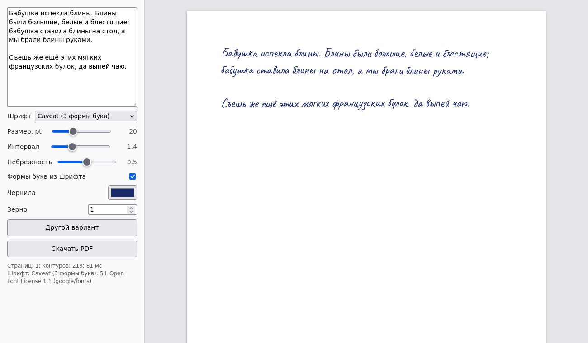

# Living handwriting → PDF

A single static page that turns typed text into handwriting-like lettering and exports it as a PDF.
No build step, no server, no framework.

**Live page:** https://caerno.github.io/generative-font/



*Русская версия — ниже.*

## What it does

- **Letter forms from the font itself.** Each letter gets a random form out of the alternates the font
  already contains, and the same letter never repeats its previous form.
- **Per-letter warp.** Every outline is smoothly distorted, slightly scaled and rotated; each line gets
  its own slope and a gentle wave. One slider ("Небрежность") controls the amount.
- **Reproducible.** One seed gives one layout, so the preview and the PDF are the same.
- **A real PDF, not a picture.** Letters are vector outlines. An invisible text layer in the same font
  sits over every line, so the PDF can be searched and copied from.
- **Runs from disk.** Plain `<script>` tags, not modules, so `web/index.html` also works from `file://`.

## Fonts

| Font | Forms per letter | Where the forms come from |
|---|---|---|
| Caveat | 3 (117 characters) | `ss01`, `ss02` |
| Shantell Sans, informal | 4 for letters, 3 for digits and punctuation | `rlig` |
| Playpen Sans | 7 for most letters | `calt` |

The alternates are collected from the font's GSUB table: every glyph reachable from the base glyph
through single or alternate substitutions in the listed features, including lookups nested in
contextual rules. `locl` is skipped, since Serbian and Bulgarian forms are different letters, not
variants.

All three fonts come from [google/fonts](https://github.com/google/fonts) under the SIL Open Font
License 1.1.

## Layout

| Path | What it is |
|---|---|
| `web/index.html` | the page; all logic is inline |
| `web/fonts.js` | fonts in base64 plus a "character → glyph ids of its forms" map; generated, do not edit |
| `web/vendor/` | pdf-lib 1.17.1 and @pdf-lib/fontkit 1.1.1, UMD builds from jsDelivr |
| `web/licenses/` | licence texts for the fonts and libraries |
| `web/check_page.py` | headless Firefox run: console errors, screenshots, PDF download |
| `fonts/build_web_fonts.py` | downloads the fonts, pins variable axes, collects alternates → `web/fonts.js` |
| `fonts/font_survey.py` | Cyrillic coverage and letter forms for every `.ttf` in a folder |

## Running

```bash
# the page: just open it
xdg-open web/index.html

# rebuild web/fonts.js (the build is reproducible: same sources give the same file)
pip install fonttools
python fonts/build_web_fonts.py

# browser check
pip install playwright && playwright install firefox
python web/check_page.py /tmp/out playpen
```

## Licences

The code in this repository is under the MIT License, see `LICENSE`. Bundled third-party parts keep
their own licences:

- Caveat, Shantell Sans, Playpen Sans: SIL Open Font License 1.1, texts in `web/licenses/`.
- pdf-lib: MIT, text in `web/licenses/`.
- @pdf-lib/fontkit (fork of fontkit): MIT according to its `package.json`; the fork has no licence file.

---

# Живой почерк → PDF

Одна статическая страница: набранный текст превращается в текст «от руки» и выгружается в PDF.
Без сборки, сервера и фреймворков.

**Страница:** https://caerno.github.io/generative-font/

## Что умеет

- **Формы букв берутся из самого шрифта.** Каждая буква получает случайную форму из альтернатив,
  которые уже есть в шрифте, и не повторяет свою предыдущую форму.
- **Искажение у каждой буквы своё.** Контур плавно искривляется, немного масштабируется и
  поворачивается; у каждой строки свой наклон и лёгкая волна. Силу задаёт ползунок «Небрежность».
- **Повторяемость.** Одно зерно даёт одну раскладку, поэтому превью и PDF совпадают.
- **Настоящий PDF, а не картинка.** Буквы — векторные контуры. Поверх каждой строки лежит невидимый
  текст тем же шрифтом, поэтому по PDF работает поиск и копирование.
- **Работает с диска.** Обычные `<script>`, не модули, поэтому `web/index.html` открывается и через `file://`.

## Шрифты

| Шрифт | Форм у буквы | Откуда формы |
|---|---|---|
| Caveat | 3 (117 символов) | `ss01`, `ss02` |
| Shantell Sans, informal | 4 у букв, 3 у цифр и знаков | `rlig` |
| Playpen Sans | 7 у большинства букв | `calt` |

Формы собираются из таблицы GSUB: все глифы, до которых из базового можно дойти одиночными или
альтернативными заменами в указанных фичах, включая lookup'ы внутри контекстных правил. `locl` не
берётся: сербские и болгарские формы — другие буквы, а не варианты.

Все три шрифта — из [google/fonts](https://github.com/google/fonts), лицензия SIL Open Font License 1.1.

Код репозитория — под лицензией MIT (`LICENSE`); шрифты и библиотеки внутри — под своими лицензиями
(OFL 1.1 и MIT, тексты в `web/licenses/`). Устройство и запуск — в английской части выше.
